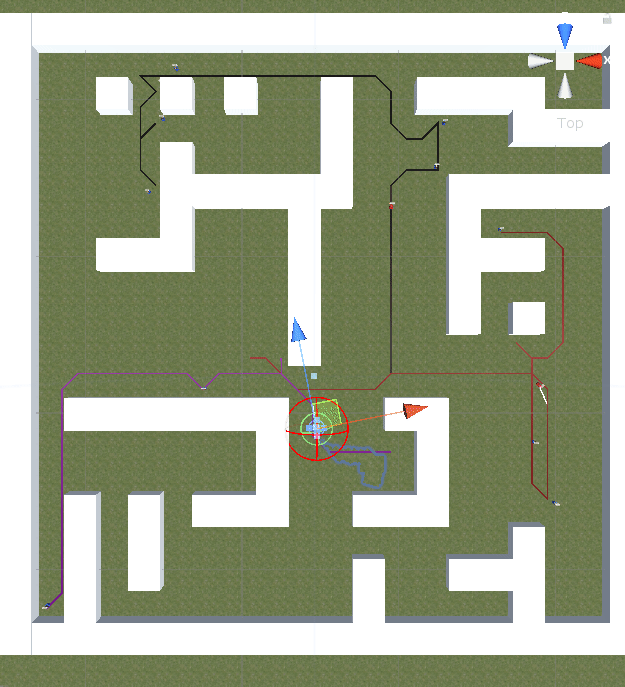

# Multi Agent project  
### Main idea
Path planning for cars to kill all enemies as long as avoid obstacles in a given maze. There are 5 problems with different settings. Each problem is setup in a different "Scene" of the unity project. The AI strategies are under `MultiAgent project/Assets/Scrips/`.

#### Problem 1: Short range multi agent search
Setting: the search area is limited within a short range.

The left window: from a global camera. The long white line indicates the car and the turret is able to see and attack each other.  
The right window: from a car camera. The green bar above the car shows its "blood". The number of enemies left to kill is shown on the top of the window.

#### Problem 2: Long range multi agent search  
Setting: the search area is limited only by obstacles.

The red and blue lines indicate the sight blocked by obstacles. When they turn to white, cars and turrets are able to detect and attack each other.

#### Problem 3:  Vehicle Routing Problem (VRP)  
Setting: given location of all enemies, solve VRP to find an overall optimal path organization for all cars.

#### Problem 4: Formation sweep  
Setting: given a leader car, the other cars need to follow it and march in formation.

#### Problem 5: Shooter coordination  
Setting: the car is easy to "die". Thus they need to move in coordination with other agents (behind obstacles)while battling against enemies. 

Circles in the same color show the locations where the left cars need to arrive at the same time. 
